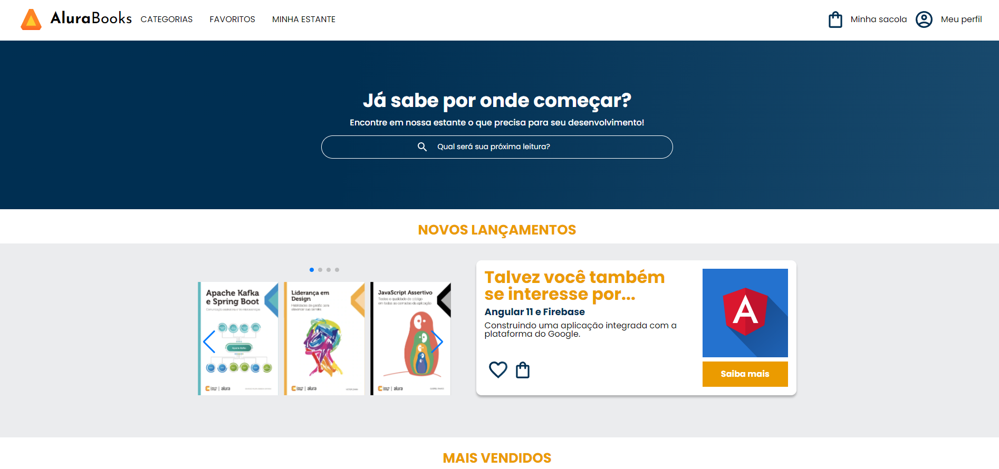

# AluraBooks
**Aplicação conhecimento curso HTML e CSS aplicando responsividade com Mobile First**

=

Um site do e-commerce AluraBooks, uma livraria online de livros sobre tecnologia.

## Tecnologias
 * HTML
 * CSS
 * SwiperJS

### Screenshots
* Mobile

* Tablet

* PC

  